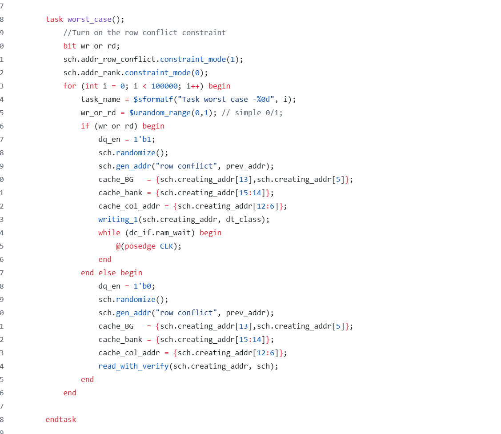

## State 
I'm not stuck with anything

## Progress
1) Adding worst case, general case and best case for DRAM performance analysis for 100K memory requests.
Detailed: I add 100K memory requests for row hit, random request and conflicted requests to analyze the total time to finish 100k requests. The 100K memory conflicted requests is the hard one duo to the incompability of referrenece model and I aiming to generalize the case as well. The previous conflicted row requests that I have is not generalized so I have to create that case, I also update the referrence model to match with 16 banks. So the referrence model right now can do 2**ROW_ADDRESS entries with 16 banks, but only testing 1 column address only (may be more) due to Verilog compiler issue. Regardless, 100K memory requests with generalize cases have been done. From that I and Dhruv perform analyze with 5.3GB/s bandwidth and 32-bit data interface (again can scale up 64-bit)
    Prove: 
        
        This is the 1 one of example, the detail would be in https://github.com/Purdue-SoCET/atalla/blob/memory_subsystem_tri/src/testbench/dram_top_tb.sv
        
2) From That, I and Dhruv spent time on preparing slides and posters for Senior VIP progress

## Future plan: 
1) Preparing senior final report
2) Writing mask implementation verificatoin
3) Timing configuratoin
