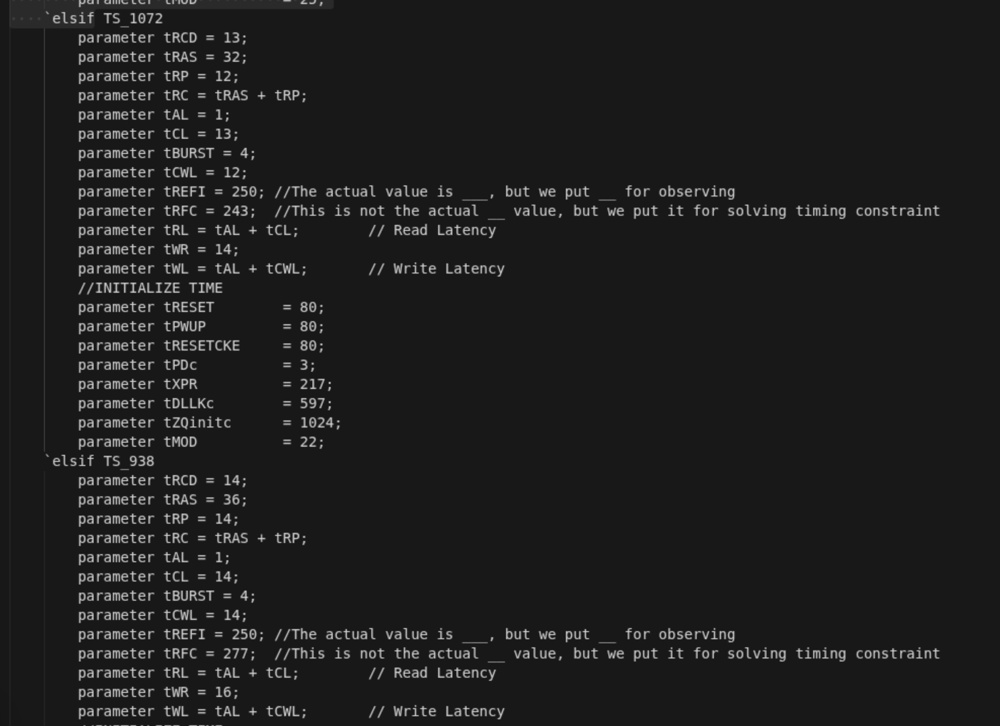
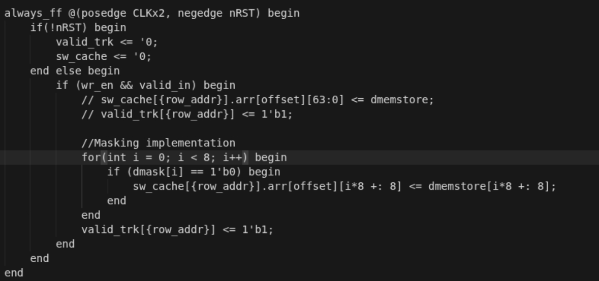

## State 
I'm not stuck with anything

## Progress
1) Timing configuration: I spent hours in calculation the timing parameter task for each DRAM timing configurations in the timing_mask.sv (Micron provide) convert it into number of DRAM clock cycles so that the DRAM controller can use to implement in different speeds. The progress what I did is that, I match the DRAM clock time speed, and every timing parameter of each specific DRAM time speed, I divide to get the timing parameter of the DRAM in DRAM clock cycle and try to test it with my Makefile. Result, currently I'm still underprogress of figure out why Micron is not following other timing configurations (even though I followed their README.md)
Prove: 

2) Writing mask: Right now, I also implement the writing mask feature for the referrence model to generalize more my test for the verification in the next semester, basically what I did is that I start off with something simple right now, having a [7:0] mask tell me what byte I don't want to write and test it with 1 burst. Result, after adding, I failed completely, due to the unmatching time issue with the referrence model but the DRAM model does show the writing mask feature. I'm still underprogress of figuring out
Prove: 

        

## Future plan: 
1) Preparing senior final report
2) Writing mask implementation verificatoin
3) Timing configuratoin (done)
