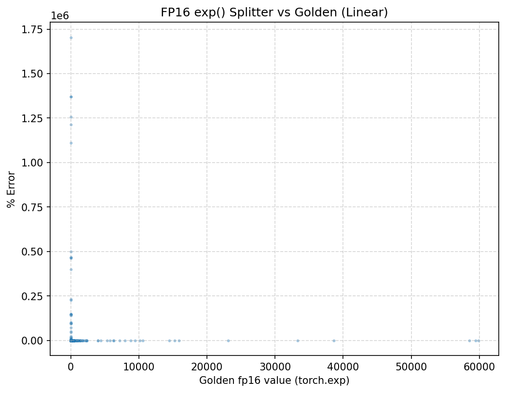
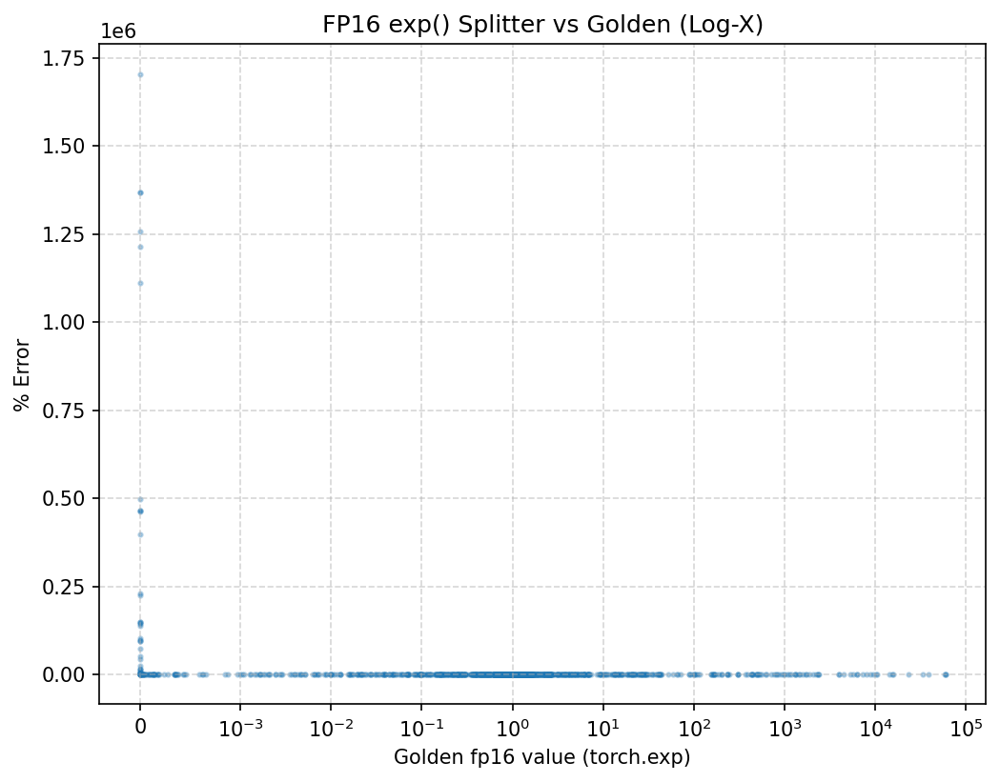

Design Log Week 4:

I am not stuck at this point of time.

-----------------------------------------------------------------
Progress:

Finished writing the Python simulation. My approach is that I input a seed to generate 10,000 or so random test cases,. Input the test cases into both the torch golden model and the functional unit model and compare against one another to get the relative % error. For the most part I'm getting % error values that are 0.5% or less. However, there are some outliers where I'm getting absurd amounts of error for which reason I do not know. Ive tried using a quartic approximation instead of a cubic taylor approximation however that does not resolve the outliers error bit a significant amount. I've plotted the % error vs the golden model output to see exactly where this error lies to get more information and from what I can see whenever the output is 0 there is a spike in error.

(*Update* the reasoning for this error is that when evaluating a negative input exp() value, the output approaches 0, thus gaining more and more error as you go=et closer to a divide by 0 for the % error plus the margin because signifcantly larger between model and golden). Through error analysis with Timmy we decided on a new approach where we one have to consider the a value, or the closest approximation point. (Base point of approximation). Not only should we change the taylor approximation but we also decided that for better use case we would use e^q as the base calculation for LUT instead of 2^q so that we can take derivatives and it stay the same for the approximation so we wouldnt have to continually calculate.

Quick thing to note(once again): Still have yet to gain access the BRS and in turn asicfab. Not a issue right now as .sv testbenches havent been started yet as I'm working on the python simulation. But I do need to be able to push this to github later so I don't exactly know if that requires some sort of forms or access to do so. (*Update* messaged Boyuan and he said the issue will be resolved soon)

Future Plans:

For upcoming tasks, I'll need to swap to the new approach and model that against the golden model in order to see if the relative error drops with the base e^x and taylor approximation changes. Once I finish that, plot it, and return with no significant error, hopefully I can start writing basic testbenches for the exp() RTL to check if it compiles and runs once its done. 